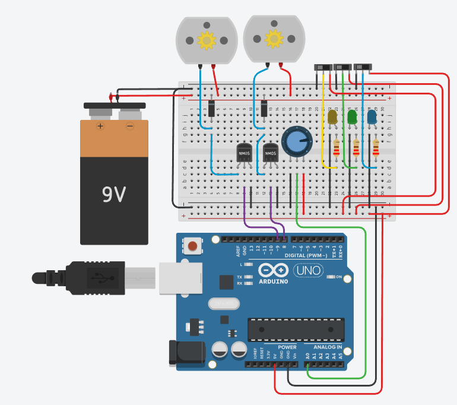

# Tinkercad Circuit — Drawing Room (one room, five devices)

**Live circuit:** _TODO — drop your public Tinkercad link here_  
(Tinkercad → **Share** → **Public** → copy the URL)

**Screenshot:** [`screenshot.png`](screenshot.png)  
**Code:** [`sketch.ino`](sketch.ino) — paste into Tinkercad under **Code → Text**

---

## What's going on here?

We built a small **Drawing Room** circuit in Tinkercad — 3 lights and 2 fans —
to show how you'd actually sense and drive office loads with a microcontroller.

The full office (3 rooms, 15 devices) lives in our Python backend and shows up
on the dashboard and Discord bot. This breadboard version is the **hardware
schematic** piece of the project: one representative room, wired in a way that
would make sense in real life (at signal level, anyway).

It runs on its own in Tinkercad. Nothing here plugs into FastAPI during the
demo — the live data still comes from `backend/sim/simulator.py`.

---

## Quick look



---

## Parts we used

| Part | Qty | Why it's there |
|---|---|---|
| Arduino Uno R3 | 1 | Reads the knob, PWMs the fans |
| Breadboard + wires | 1 | Holds it all together |
| 9 V battery | 1 | Motor power on the rails |
| N-channel MOSFET (nMOS) | 2 | Switches the fans — Uno can't drive motors directly |
| Flyback diode | 2 | Protects the MOSFET when the motor spins down |
| DC motor | 2 | Stand-in for Fan 1 and Fan 2 |
| LED (yellow, green, blue) | 3 | Stand-in for the three lights |
| 220 Ω resistor | 3 | Keeps the LEDs from frying |
| Slide switch | 3 | Pretend wall switches, one per light |
| Potentiometer | 1 | Turn it to change fan speed (wired to A0) |

---

## How things are wired

### Fans (Arduino-controlled)

Both fans use the same pattern — a **low-side nMOS switch**:

```text
Motor supply → motor → Drain
Source → GND
Gate ← D8 or D9 (PWM)
```

| Pin | Does what |
|---|---|
| **D8** | PWM → MOSFET 1 → Fan 1 |
| **D9** | PWM → MOSFET 2 → Fan 2 |
| **A0** | Potentiometer wiper — the "speed dial" |

Turn the pot and both fans speed up or slow down together (same PWM on 8 and 9).

### Lights (manual switches)

The three LEDs aren't on Arduino pins in this build. Each one has its own slide
switch, like a wall switch in series with the fixture:

```text
+ rail → switch → LED (+) → 220 Ω → GND
```

That was a deliberate choice: the fans show **MCU → driver → load**, while
the lights show **human switch → load** — which is how a lot of office wiring
actually works.

| Pin | Notes |
|---|---|
| **5V / GND** | Power rails for logic and LEDs |
| *(no D2–D4)* | Lights are switch-controlled, not sketch-controlled |

---

## The sketch

[`sketch.ino`](sketch.ino) is short and does one thing:

1. Read the pot on **A0** (0–1023)
2. Map it to PWM (0–255)
3. Write that value to **D8** and **D9**
4. Print to Serial every 100 ms at **9600 baud**

You'll see lines like:

```text
sensor = 512     output = 127
```

### Try it yourself

1. Paste the sketch into Tinkercad (**Code → Text**)
2. Hit **Start Simulation**
3. Open **Serial Monitor** (9600 baud)
4. Twist the pot — numbers change, motors respond
5. Flip the slide switches — each LED toggles on its own

---

## Real office vs. this breadboard

Tinkercad can't do mains AC or a full panel board, so we kept it at **logic
level**. The idea still carries:

| What you see here | What you'd do in a real office |
|---|---|
| DC motor + nMOS | Fan on a relay/contactor or proper motor driver |
| Slide switch + LED | Wall switch in the AC line to the fixture |
| Pot on A0 | Schedule, occupancy sensor, or BMS rule |
| 9 V / 5 V rails | Fused distribution from the panel |

The signal the MOSFET gate sees is the same kind of signal you'd send to a
relay coil in production — only the load side changes.

---

## How this fits the rest of the project

```text
Tinkercad (this folder)     →  schematic for judges / docs
        │
        │  not connected at demo time
        ▼
backend/sim/simulator.py    →  live state for dashboard + Discord
```

Same project, two layers: **physical concept** here, **running software** in
the repo.

---

## Files here

| File | What it is |
|---|---|
| [`README.md`](README.md) | You're reading it |
| [`sketch.ino`](sketch.ino) | Arduino code for Tinkercad |
| [`screenshot.png`](screenshot.png) | Circuit image for the repo |
| `led-*-guide.png` | Extra wiring notes from earlier drafts (optional) |

---

## Before we submit

- [x] `sketch.ino` in the repo
- [x] `screenshot.png` in the repo
- [ ] Public Tinkercad link at the top of this file
- [ ] Ran sim once — pot moves motors, switches toggle LEDs, Serial looks right

---

## Extra LED wiring notes

We have a couple of helper images (`led-vertical-resistor-correct.png`,
`led-wiring-guide.png`) from when we were experimenting with Arduino-driven
LEDs on D2–D4. **Not needed** for the current slide-switch design — kept around
in case we revisit that wiring later.
